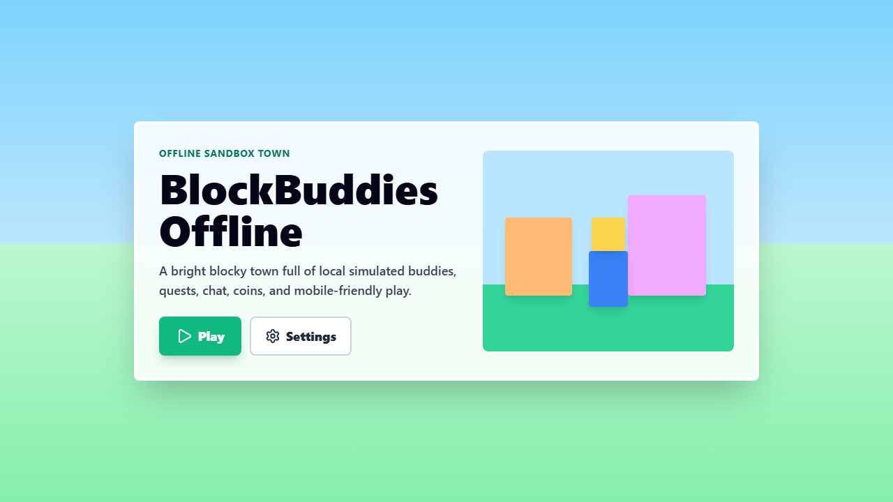
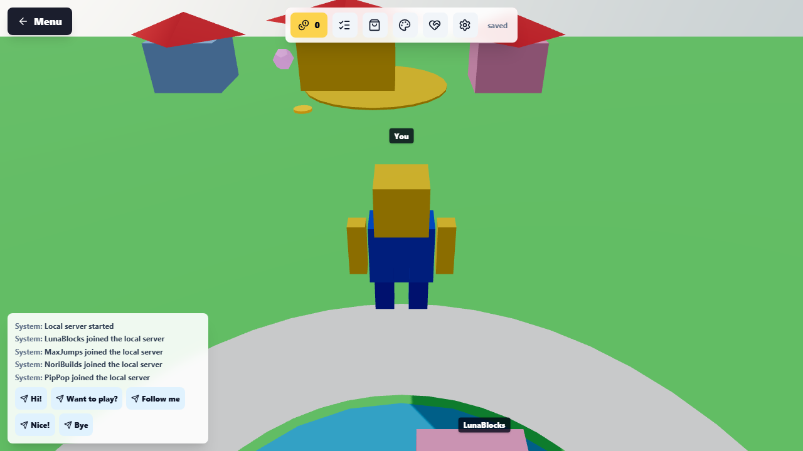
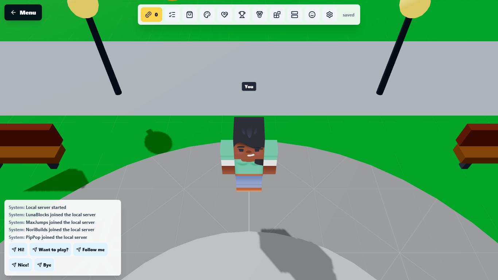
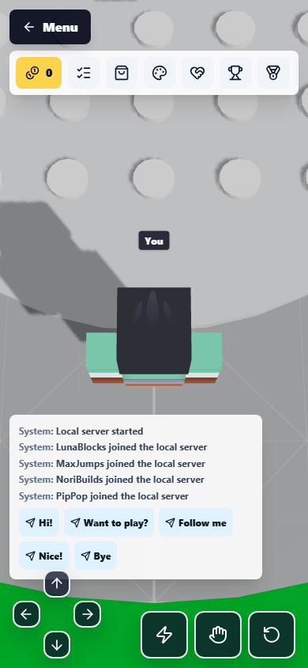

# BlockBuddies Offline

BlockBuddies Offline is a colourful web-first 3D sandbox town where local AI
buddies make the world feel like a small multiplayer server without using the
internet. It is inspired by blocky sandbox play, but it uses original procedural
shapes, UI, names, and dialogue.

## Screenshots

Screenshots are stored in `docs/screenshots/` and `docs/review/`.









## Features

- Bright low-poly 3D town with spawn, park, shop, school, obby, and houses.
- Third-person blocky player with desktop movement and mobile touch controls.
- Eight AI-simulated buddies with usernames, profiles, schedules, moods, goals,
  state transitions, and visible actions.
- Local fake multiplayer chat, speech bubbles, quick replies, join messages, and
  kid-safe dialogue templates.
- Five starter quests, rewards, coin pickups, local progress saving, and bot
  reactions.
- Beginner obby with checkpoints, finish reward, restart/start control, and bot
  cheering.
- Coin shop, unlockable avatar items, body/shirt colours, hat placeholder, and
  trail placeholder.
- Bot memory, friendship levels, times met, and relationship-aware greetings.
- Offline badges, leaderboard, emotes, build/place mode, and local server list.
- Kenney CC0 blocky character models and prototype grid textures.
- PWA manifest, service worker offline cache, settings, graphics quality,
  reduced motion, audio/music toggles, and save reset.
- Capacitor Android project with debug APK output.

## Tech Stack

- Vite, React, TypeScript
- Three.js, `@react-three/fiber`, Drei, Rapier
- Zustand
- Tailwind CSS
- localForage / IndexedDB
- Vite PWA plugin
- Capacitor Android
- Vitest and Playwright

## Setup

```bash
npm install
```

## Development Commands

```bash
npm run dev
npm run preview
```

## Test Commands

```bash
npm run lint
npm run typecheck
npm run test
npm run e2e
```

## Build Commands

```bash
npm run build
npm run cap:sync
npm run android:debug
```

## PWA and Offline Notes

The PWA plugin generates a service worker with an offline app shell. The game
does not depend on live servers for bots, dialogue, quests, inventory, memory,
or saves. After the first successful load, the production build is cacheable for
offline play.

## Android APK Build

Capacitor writes the Android project to `android/`. Debug APKs are built with:

```bash
npm run build
npm run cap:sync
npm run android:debug
```

On this Windows machine, set `JAVA_HOME` to Android Studio's bundled JBR if Java
is not on PATH:

```powershell
$env:JAVA_HOME = "C:\Program Files\Android\Android Studio\jbr"
$env:Path = "$env:JAVA_HOME\bin;$env:Path"
```

Debug APK output:

`android/app/build/outputs/apk/debug/app-debug.apk`

Release signing is not configured. For a production APK, configure Gradle
signing properties or use Android Studio's signed bundle/APK flow, then run a
release build.

## Project Structure

- `src/game` - 3D scene, world, player, NPCs, physics, interactions
- `src/ui` - menus, HUD, chat, inventory, avatar editor, settings
- `src/state` - Zustand stores
- `src/ai` - simulated player brains, routines, dialogue, goals, memory
- `src/data` - bot profiles, quests, items, world config
- `src/save` - local persistence
- `src/assets` - models, textures, icons, sounds
- `android` - Capacitor Android project
- `docs` - architecture and phase notes

## Phase Roadmap

See [PHASES.md](./PHASES.md).

See [docs/feature-review.md](./docs/feature-review.md) for the current review of
what works, what was fixed, and what remains out of scope for an offline
Roblox-inspired prototype.

## Known Limitations

- This is a complete prototype, not a production-scale multiplayer game.
- Building collision is visual-only; floor/checkpoint safety is implemented.
- Ghost racers are represented by buddy reactions rather than full racing AI.
- The Three.js bundle is large and should be code-split before a store release.
- Android production signing is not configured; release artifacts use debug APKs.
- Full Roblox-platform features such as real multiplayer servers, Robux,
  moderation, voice chat, creator marketplace publishing, and cloud social graph
  are intentionally out of scope for this offline prototype.
- If an older Android debug APK showed old cached visuals after an update,
  install `v1.3.1-mobile-character-fixes` or later; native startup clears stale
  WebView service worker caches before rendering.

## Credits

No Roblox branding, names, logos, assets, UI, or copied content are used.
Runtime third-party assets are listed in
`src/assets/licenses/assets-manifest.json`; the current imported assets are
Kenney CC0 blocky characters and prototype textures.

## License

Prototype project. Add a formal license before public distribution.
