# BlockBuddies

BlockBuddies is a colourful web-first 3D sandbox town where local AI
buddies make the world feel like a small multiplayer server without using the
internet. It is inspired by blocky sandbox play, but it uses original procedural
shapes, UI, names, and dialogue.

## Screenshots

Screenshots are stored in `docs/screenshots/` and `docs/review/`.


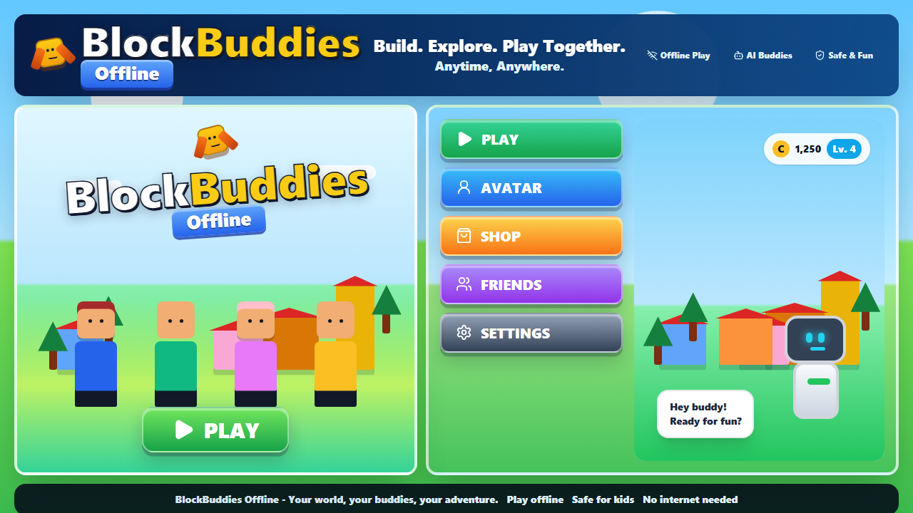

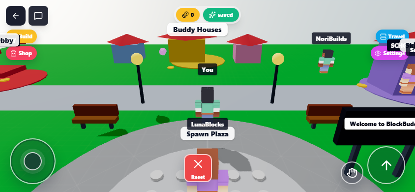

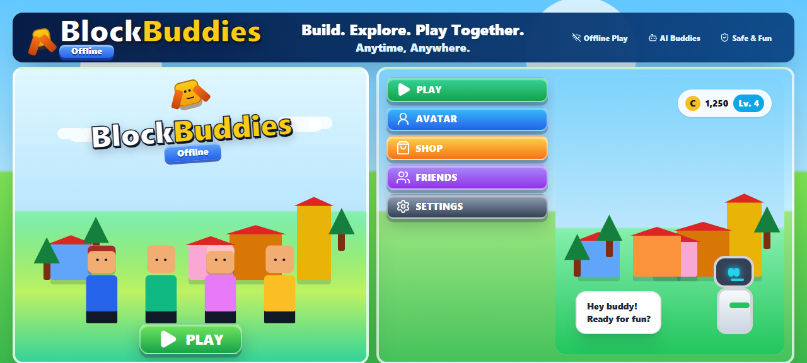

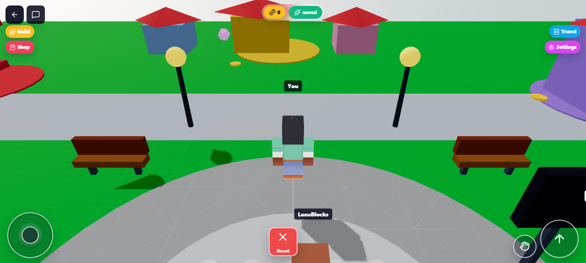

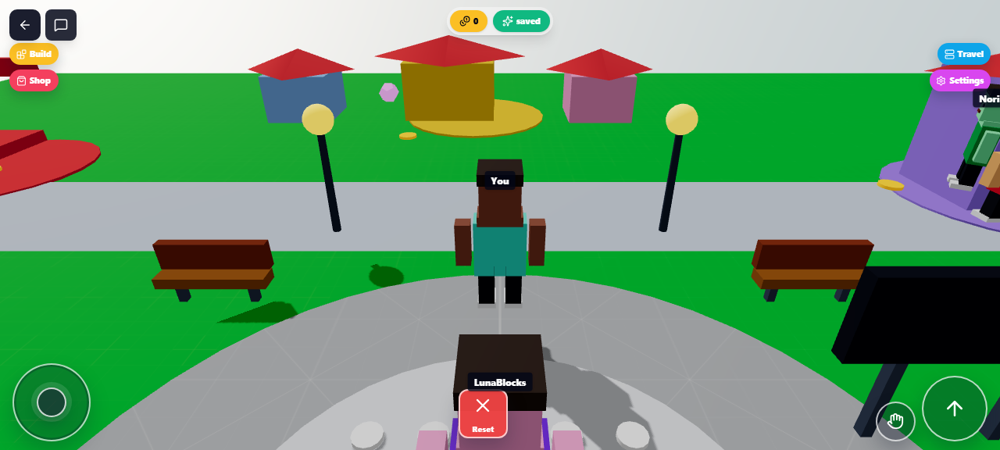

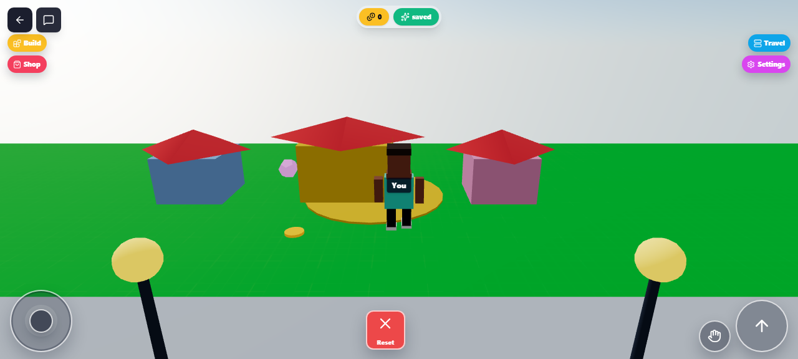

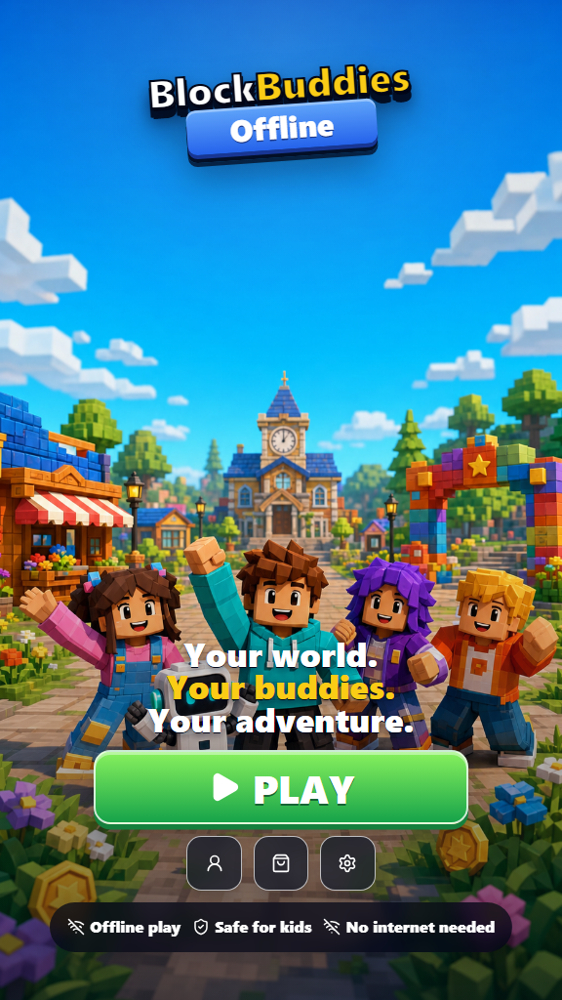

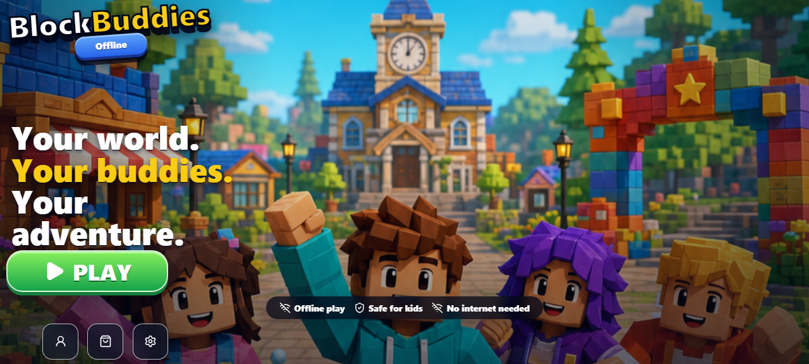

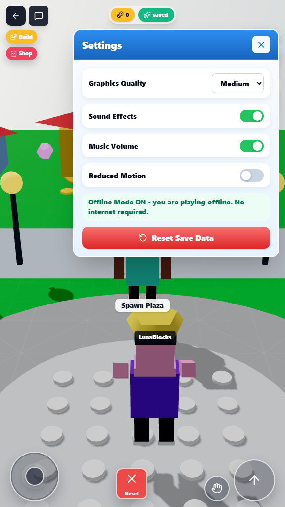

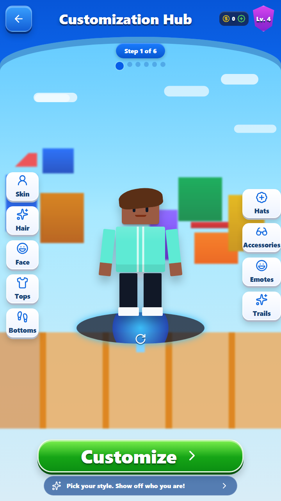

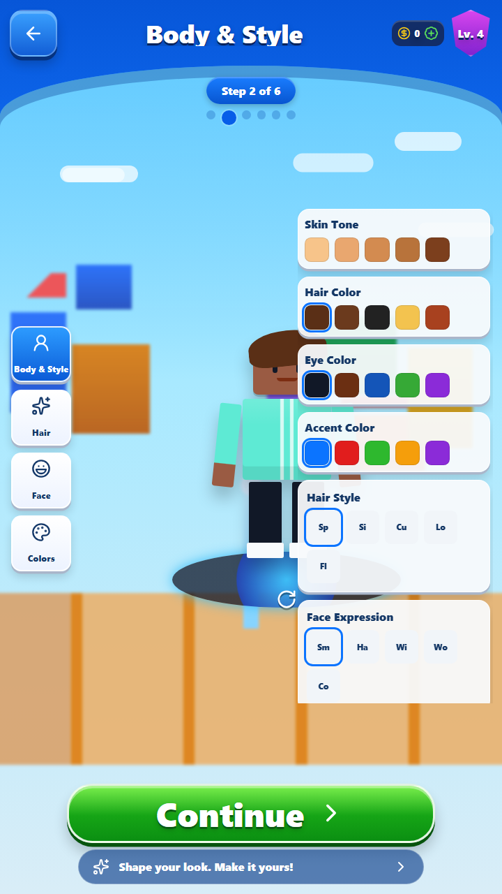

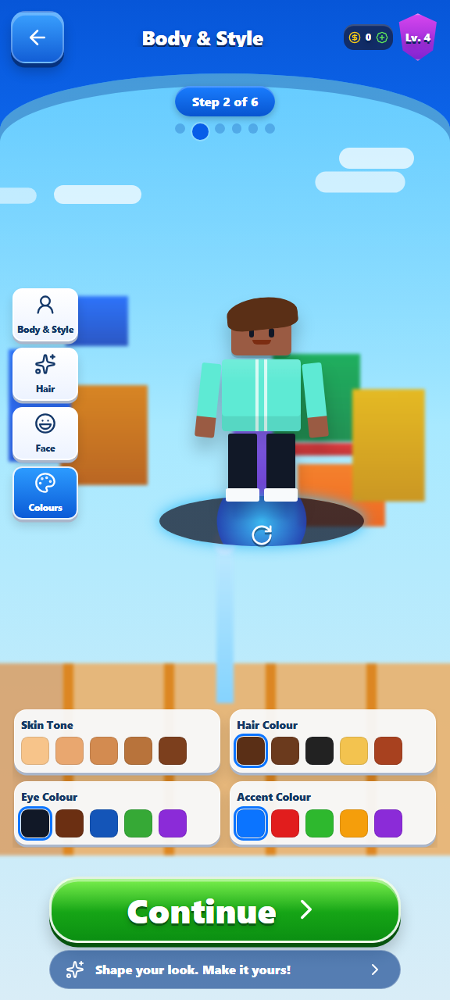

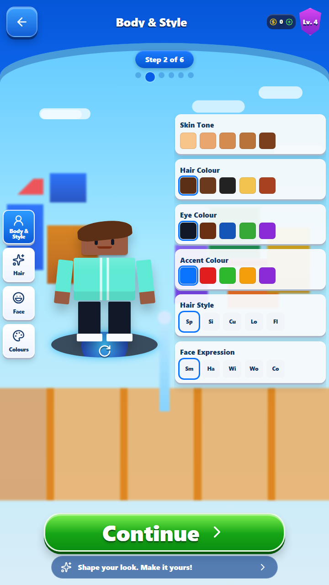

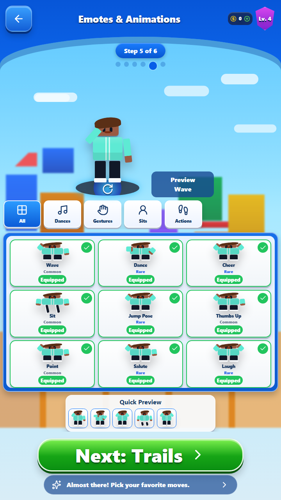

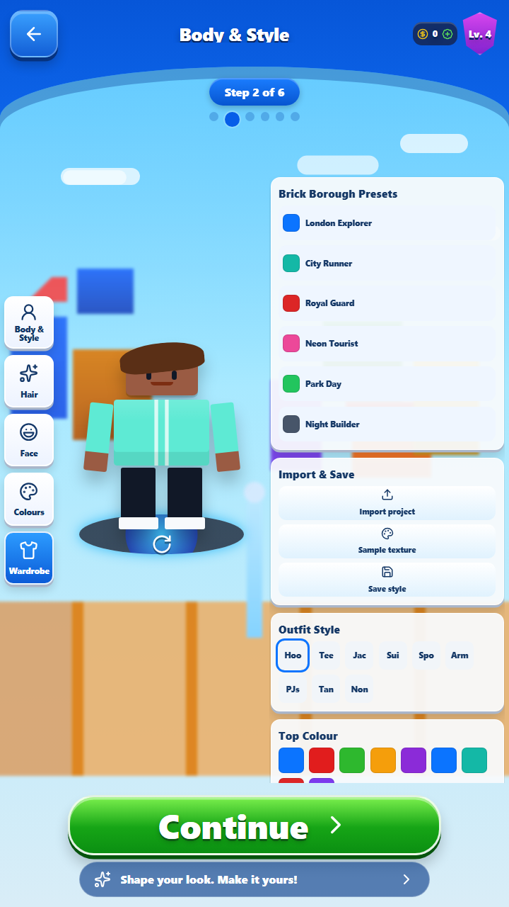

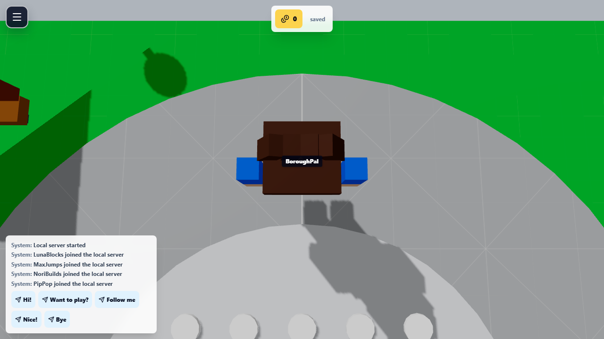


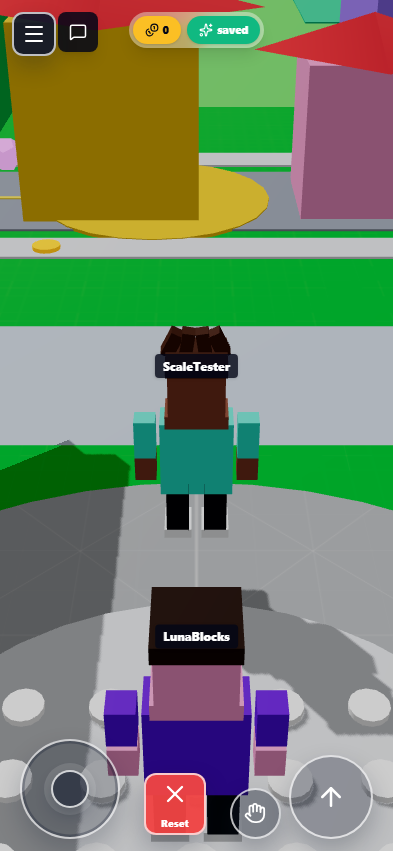

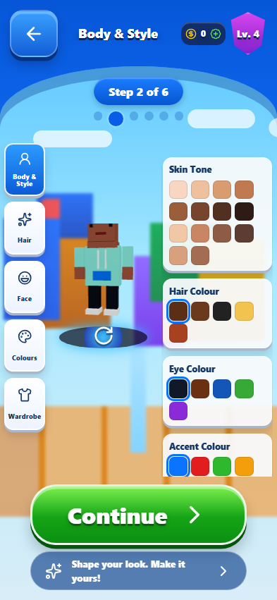

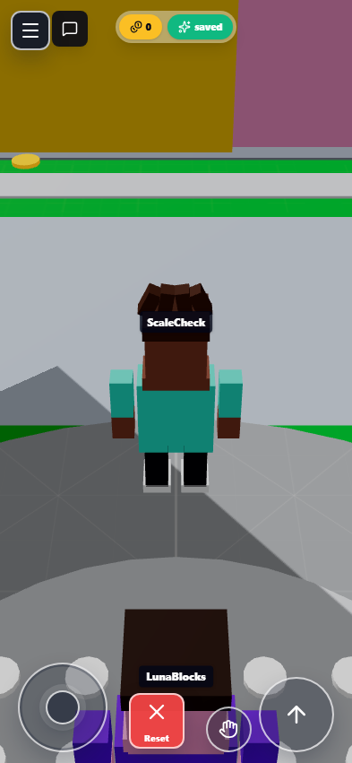

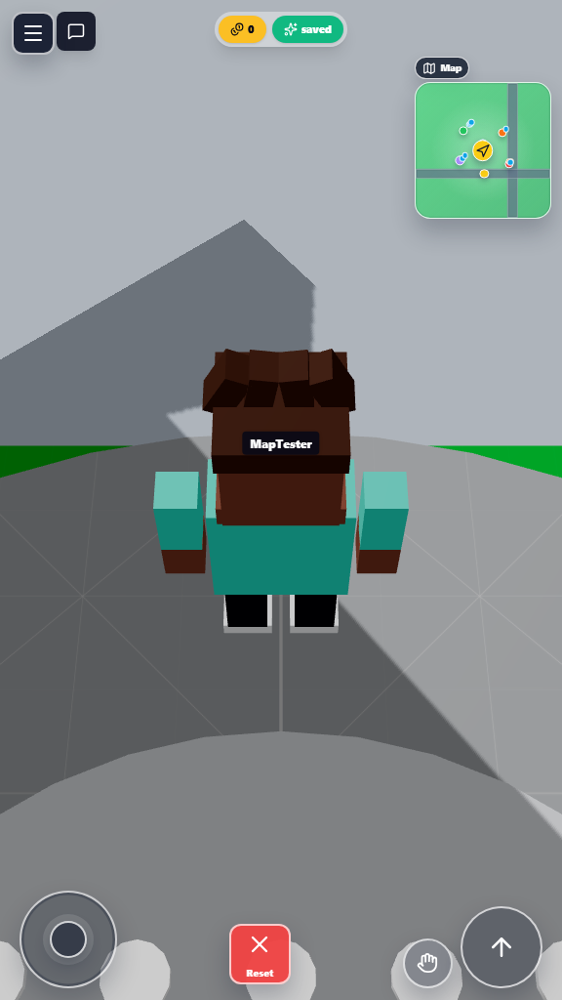

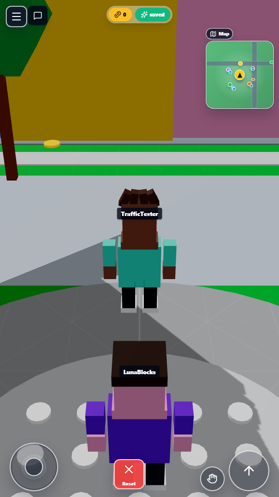

## Features

- Bright low-poly 3D town with spawn, park, shop, school, obby, and houses.
- Third-person blocky player with desktop movement and mobile touch controls.
- Eight AI-simulated buddies with usernames, profiles, schedules, moods, goals,
  state transitions, and visible actions.
- Local fake multiplayer messaging with a buddy inbox, unread badges, visible
  in-world Message buttons that appear only after selecting a person, speech
  bubbles, join messages, and 100 kid-safe predefined message presets.
- Expanded Quest Log with tappable mobile cards, full how-to instructions,
  Active/Daily/Completed tabs, rewards, local progress saving, and bot
  reactions.
- Kid-friendly quest loops cover exploring, messaging buddies, collecting coins,
  obby, building, driving, sitting, sleeping, emotes, Coin Rush, Delivery Dash,
  and Hide & Seek.
- Beginner obby with checkpoints, finish reward, restart/start control, and bot
  cheering.
- Original offline mini-games: Coin Rush, Delivery Dash, and Hide & Seek with
  world start pads, score HUD, timed goals, local records, chat reactions, coin
  rewards, and a Mini Game Star badge.
- Reusable mini-game engine for collection and ordered-route activities, with
  server-style start popups, bold countdowns, points, best-point records, and
  local sound effects for starts, pickups, wins, and failures. Coin Rush is the first polished flow with spendable
  pickup coins, glowing mesh pickups, and completion scoring.
- Game-wide procedural music and WebAudio sound effects cover menu transitions,
  customization, buddy messages, inbox opens, replies, errors, quests, badges,
  shop unlocks, emotes, seats, beds, build mode, obby, vehicles, and mini-games
  while respecting the audio/music settings toggles.
- Delivery Dash is a mapped delivery route with a parcel pickup, ordered
  drop-offs, active minimap/town-map markers, per-stop coin rewards, and time
  bonuses.
- Coin shop, unlockable avatar items, body/shirt colours, hat placeholder, and
  trail placeholder.
- Original superhero-style avatar skins with capes, chest emblems, suit trim,
  gloves, armour panels, and a dedicated Hero Skins tab in Clothing.
- Layered grid-based town generation with shared road coordinates, terrain
  tiles, sidewalks, zoning, parks, clear entrances, and player-buildable
  parcels. The generation and placement rules are documented in
  [`docs/WORLD_GENERATION.md`](docs/WORLD_GENERATION.md).
- The 3D world, traffic, minimap, placement validation, and bird's-eye review
  page consume the same tiled road plan. Authored buildings, benches, activity
  pads, collectibles, parking, and obby pieces are validated against terrain
  and exclusive occupancy cells before release.
- Full-screen six-step avatar Customization Hub with Body & Style, Clothing,
  Hats & Accessories, Emotes & Animations, and Trails & Effects screens.
- The mobile customizer follows a four-column flex guide with separate preview,
  category, catalog/control, and Save/Next rows for portrait phone screens.
- Character setup includes explicit Save Character controls, automatic saving
  when setup completes, saved-character selection, and editable player names.
- Body & Style customizer uses a responsive phone grid for the character
  preview, five category buttons, and colour/control panels while switching
  between Body, Hair, Face, Colours, and Wardrobe.
- Character customisation and name setup use the same 3D block avatar renderer
  as the in-game player, so selected colours and parts match gameplay.
- Brick Borough-inspired wardrobe controls with local presets, saved avatar
  styles, project JSON import, texture colour sampling, outfits, bottoms, and
  shoe styles.
- Emotes & Animations uses a portrait phone layout with category options below
  the preview and a full-width emote catalog.
- Startup flow now routes Start through character customisation, character name
  entry, and then the 3D town.
- Chosen character names appear above the player, in local messages, in Local
  Party identity, and in the leaderboard.
- Bot memory, friendship levels, times met, and relationship-aware greetings.
- Saved custom friends can be created from the Buddies menu, added back into
  the town, shown on the mini-map/full map, persisted locally, and messaged
  through predefined inbox threads.
- Offline badges, leaderboard, emotes, build/place mode, and local server list.
- Local Party nearby multiplayer with manual WebRTC invite/answer codes and
  live synced player avatars.
- Local Party invite and answer codes have Copy and Share buttons, using native
  device sharing when available and clipboard fallback otherwise.
- Local Party codes use compact compressed `BBP1` signals, Paste buttons, shared
  text extraction, and same-origin guest-answer handoff while keeping host
  approval through Accept Join Answer.
- Android APK Local Party mode can host a LAN room from the host phone, advertise
  it on the local network, let guests discover the room name, send the WebRTC
  answer back through the host phone, and keep host approval through Accept Join
  Request.
- Custom world builder with blocks, roads, houses, towers, shops, cars, trees,
  lamps, rotation, colour swatches, undo, and procedural Auto Street maps.
- Build Mode shows a floor grid and green placement preview, with a drawer-style
  catalog plus a compact left-side HUD list for selecting build pieces. Tapping
  a placed item gives it a yellow outline so that exact item can be removed.
- House previews render the real model and a yellow front-door arrow. Selecting
  a placed house opens a responsive editor for rotating it and changing its
  persistent name; named houses keep that title in saves, interiors, and Local
  Party synchronization.
- Solid build placement reserves avatar clearance, and collision recovery moves
  players out of overlapping saved or synchronized builds instead of trapping
  them inside a wall.
- Deterministic procedural borough streaming with tiled roads, pavements, parks,
  buildings, street props, phone boxes, landmarks, world seeds, view
  distance, and night mode settings.
- Procedural borough chunks now use sparser building placement and wider roads
  so the town feels more open for blocky sandbox movement, traffic, and building.
- Walk-in doorway triggers let the player enter static town houses, shops,
  schools, procedural borough buildings, and player-built houses/shops/towers.
- Indoor prototype rooms include house, shop, school, and tower-lobby layouts
  with walls, furniture, exit pads, indoor minimap context, coarse collision, and
  a contextual sleep/wake interaction on house beds. Room arrival and exit points
  keep the player clear of doorway triggers so transitions do not loop.
- School classrooms include Ms Maple, a lesson whiteboard, a teacher desk, and
  six student stations. Chair icons appear near usable classroom chairs, house
  and lobby sofas, and outdoor benches; selecting one seats the live avatar and
  exposes a Stand action.
- Buddy Parking contains three enterable cars and is available as a town-map
  travel destination. Players can drive, steer, brake, orbit the chase camera,
  and exit at a collision-safe position. Cars collide with scenery, parked and
  moving vehicles, buildings, buddies, and local-party players instead of
  passing through them, while low road, driveway, pavement, and parking surface
  boxes remain driveable instead of acting like invisible walls.
- Doorway safe zones clear blocking collision from trees, lamp posts, phone
  boxes, traffic props, and user-built props near supported doors.
- Height-aware visible-object collision prevents the player from walking through
  buildings, moving cars, trees, lamps, phone boxes, landmarks, furniture, and
  placed build pieces while supporting gravity, landable tops, and blocked undersides.
- Shared real-world scale rules keep the block avatar, doors, floor heights,
  buildings, cars, roads, trees, and lamps in proportion to a nominal 1.78 m
  person.
- A deterministic invisible placement grid gives buildings, scenery, activity
  pads, and collectibles exclusive cells with terrain-specific rules. Roads
  stay clear, parks contain park scenery, sidewalks are wider, and lamps are
  restricted to sidewalk edges while entrances remain accessible.
- Landmark roads are included in the final scenery cleanup, so generated trees
  and phone boxes are removed if a later road or pavement overlaps them.
- Moving traffic cars follow deterministic procedural road-grid lanes with
  tested wrapping/path logic, synchronized collision boxes, and pedestrian
  yielding for players, AI buddies, and local-party players.
- Responsive minimap shows nearby roads, buddies, landmarks, traffic, and the
  player facing direction with screen-space heading correction. Tap it, or use
  Town Map in the hamburger menu, to open a full map and fast travel to Spawn
  Plaza, Buddy Park, Coin Shop, Skill School, Beginner Obby, or Buddy Houses.
- Fast travel uses tested arrival points outside occupied building footprints,
  exits interiors cleanly, resets held controls, and is disabled while a timed
  obby or mini-game is active.
- Kenney CC0 blocky character models and prototype grid textures.
- In-game hamburger menu keeps customisation, shop, quests, build mode, Local
  Party, badges, leaderboard, emotes, and settings out of the main HUD.
- The first game entry shows a welcome overlay with core controls, interaction,
  and Local Party guidance, with a shortcut into the Tutorial panel.
- Landscape mobile game HUD with messages icon, status pills, virtual joystick,
  circular jump, hold-to-run, contextual interact, and reset/remove controls.
  Running is 2x walking speed; desktop players hold Shift to run. While driving,
  left/right screen input is mapped through the car steering adapter so it turns
  in the pressed direction, the same movement input accelerates, and jump becomes a
  hold-to-brake button, and the contextual action exits the car.
- Character left/right movement is screen-relative to the visible camera view,
  so left input moves the avatar left on screen after camera orbit.
- Touch and mouse dragging on the world view rotates and tilts the third-person
  camera independently from the movement joystick.
- Redesigned splash/menu, logo, panels, shop, quest log, avatar editor, settings,
  and buddy profile screens inspired by the supplied screen design sheet.
- Responsive landscape phone layout with compact menu cards, messages icon, safe-area
  spacing, and reference-style joystick/jump controls.
- Android immersive fullscreen mode that hides system bars for the game-like
  landscape layout.
- Grounded procedural block avatars with visible walking leg and arm animation.
- Portrait-first splash poster matching the supplied design direction, with a
  generated original town background and responsive Play button placement.
- Splash now groups the larger logo and Start button at the top, keeps the
  slogan below the controls, removes the old no-internet badge copy, adds a
  tactile Start press effect, and credits Remetheia Games.
- PWA manifest, service worker offline cache, settings, graphics quality,
  reduced motion, audio/music toggles, and save reset.
- Capacitor Android project with debug APK output.

## Tech Stack

- Vite, React, TypeScript
- Three.js, `@react-three/fiber`, Drei, Rapier
- Zustand
- Tailwind CSS
- localForage / IndexedDB
- Vite PWA plugin
- Capacitor Android
- Vitest and Playwright

## Setup

```bash
npm install
```

## Development Commands

```bash
npm run dev
npm run dev:map
npm run preview
```

`npm run dev:map` opens the standalone tiled world review at
`http://localhost:5173/world-map.html`. The page shows terrain and object
layers, invalid placement diagnostics, per-tile inspection, and JSON export.

## Test Commands

```bash
npm run lint
npm run typecheck
npm run test
npm run e2e
npm run e2e:vrt
```

`npm run e2e:vrt` checks the committed portrait splash and character-customizer
screenshots as well as their measured row boundaries and preview containment.

## Build Commands

```bash
npm run build
npm run cap:sync
npm run android:debug
```

## PWA and Offline Notes

The PWA plugin generates a service worker with an offline app shell. The game
does not depend on live servers for bots, dialogue, quests, inventory, memory,
or saves. After the first successful load, the production build is cacheable for
offline play. Current builds use auto-update, client claiming, and outdated cache
cleanup so installed web/PWA sessions pick up new UI bundles more reliably.

Local Party multiplayer is peer-to-peer and uses manual invite/answer codes. It
does not use BlockBuddies cloud servers, matchmaking, accounts, or free-text
chat. WebRTC support and local network/browser permissions can affect whether
two nearby devices connect.

In the Android APK, Local Party also includes LAN room signaling. The host phone
runs a small local handshake server and advertises a room name with Android
Network Service Discovery. Guests on the same Wi-Fi can find the room and send
their join answer back to the host automatically. The host still accepts the join
request. This native room mode is not available in the web/PWA build because
browsers cannot open LAN server sockets from ordinary web pages.

## Android APK Build

Capacitor writes the Android project to `android/`. Debug APKs are built with:

```bash
npm run build
npm run cap:sync
npm run android:debug
```

On this Windows machine, set `JAVA_HOME` to Android Studio's bundled JBR if Java
is not on PATH:

```powershell
$env:JAVA_HOME = "C:\Program Files\Android\Android Studio\jbr"
$env:Path = "$env:JAVA_HOME\bin;$env:Path"
```

Debug APK output:

`android/app/build/outputs/apk/debug/app-debug.apk`

The `v1.3.4` and later debug APKs clear stale Android WebView cache/storage once for this
app version before the Capacitor web bundle loads. This is intentional so older
installed debug APKs cannot keep showing the pre-refresh menu or always-open
chat UI from an old service worker.

The `v1.3.5` APK also enters immersive sticky fullscreen so Android status and
navigation bars do not shrink the game viewport. If a user swipes the bars back,
the app hides them again when focus returns.

The `v1.3.6` APK removes the forced landscape orientation so the splash can open
in portrait. The splash uses the measured Android WebView height, so the Play
button stays visible when system UI changes the available space.

The `v1.5.0` APK adds Copy/Share actions for Local Party codes and screen-drag
camera control for mobile gameplay.

The `v1.5.1` APK compresses Local Party codes, adds Paste buttons, falls back to
copying when Share fails, and can prefill host answers automatically for sessions
running in the same app origin. Cross-device offline play still uses share/copy
codes because there is no cloud signaling server.

The `v1.5.2` APK adds Android LAN room signaling. Host devices advertise a room
name and run the handshake server locally, guests discover rooms on the same
Wi-Fi, and manual accept codes are only needed as fallback.

The `v1.5.3` APK widens procedural roads and pavements, reduces generated
building density, and removes late-overlapping scenery blockers from roads.

The `v1.5.4` APK adds enterable places. Walking into supported doorways opens an
indoor room, and the exit pad returns the player to the same outdoor door.

The `v1.5.5` APK adds doorway safe zones, removes generated scenery blockers
from procedural door approaches, grounds indoor characters, and disables outdoor
traffic collision checks while inside rooms.

The `v1.5.6` APK grounds animated player, bot, local-party, and indoor buddy
avatars against a shared measured foot offset, and reframes the 3D character
customization preview so the avatar head is not clipped on phone screens.

The `v1.5.7` APK adds original offline mini-games through the hamburger menu and
town start pads: Coin Rush, Delivery Dash, Hide & Seek, and the existing
Beginner Obby. These use local score state, rewards, records, and buddy chat
reactions without Roblox-owned branding or copied assets.

The `v1.5.8` APK adds a responsive full-town map with collision-safe fast travel
to six key places. It also includes cleaner mobile customization, tested local
party and mini-game flows, sprint controls, safer traffic yielding, bed sleep
interaction, direct camera orbit, and a name screen that does not open the
keyboard until tapped.

The `v1.5.9` APK saves the character profile created during setup, including the
chosen avatar and character name. Returning players now go straight from Start
into the game after the local save loads, and startup autosave waits for
IndexedDB/localForage so defaults cannot overwrite an existing character.

The `v1.5.10` APK removes the customisation turntable, rotates the live avatar
by direct drag, restores the pre-sleep camera pose, and adds full gameplay orbit
control. Its rule-based world grid keeps roads clear, widens sidewalks, places
street furniture at sidewalk edges, and prevents scenery, activities, and coins
from sharing occupied cells.

The `v1.5.11` APK makes walking and running camera-relative. Joystick or keyboard
forward now always moves away from the camera after orbiting, while the avatar
turns toward travel without changing the chosen camera angle. Combined diagonal
input is normalised to the same maximum speed as straight movement.

The `v1.5.12` APK refines camera-relative movement to use the currently visible
camera-to-player direction. Forward now follows the view immediately after
drag-orbiting left or right, even while the chase camera is still easing toward
its new position.

The `v1.5.13` APK moves normal-play reset into the hamburger menu as Reset to
Square. It returns the player to Spawn Plaza, clears active poses and activities,
and snaps the camera back to the default orbit. The old bottom reset slot is now
a compact mobile emote toggle for Wave, Dance, Cheer, and off.

The `v1.5.14` APK makes vehicle mode clearer on mobile. After entering a car,
the joystick switches to a Drive control, the right action becomes Brake, and a
dedicated Exit car button replaces normal emotes. The duplicate floating exit
prompt is hidden on phone layouts.

The `v1.5.15` APK fixes car steering direction so left and right drive input
turn the vehicle the same way the player is pressing.

The `v1.5.16` APK fixes the remaining driving control mapping issue where left
screen input could still turn the car right.

The `v1.5.17` APK fixes walking character left/right input being mirrored in the
game camera view.

The `v1.5.18` APK adds the reusable mini-game engine layer and polishes Coin
Rush with a start popup, bold timer, points, records, sound effects, and tested
end-to-end gameplay.

The `v1.5.19` APK fixes Coin Rush coin-balance feedback so the top HUD updates
on each pickup. It also reduces mobile freeze risk by removing per-pickup DOM
labels and point lights, lowering coin geometry cost, and reusing one WebAudio
context for mini-game tones.

The `v1.5.20` APK rebuilds Delivery Dash into a clearer pickup-and-drop-off
route. The HUD, minimap, and town map all point to the active delivery target,
drop-offs award immediate coins and time bonuses, and the route no longer
starts on top of the first objective.

The `v1.5.21` APK makes driving discoverable from normal play. Buddy Parking is
now a teleport destination on the town map, the arrival point lands beside a
drivable car, parked cars show Drive labels, and tapping/clicking a nearby car
or its Drive button starts driving.

The `v1.5.22` APK adds broader local sound cues for coins, panels, travel, cars,
and mini games. It also fixes the minimap coordinate conversion so markers and
the player arrow track the same screen direction as the character.

The `v1.5.23` APK tightens movement and driving. Players and cars now use swept
collision checks to avoid tunneling through thin objects, Buddy Parking keeps a
wider clear zone around cars and the driveway, moving traffic stops behind cars
ahead, and the Music setting now plays a local procedural background loop.

The `v1.5.24` APK focuses the driving engine. Player car controls now pass
through a tested drive-input adapter, cars have clear front/rear lights, and the
procedural borough keeps trees, phones, and lamps outside a wider drivable road
corridor while preserving sidewalk furniture.

The `v1.5.25` APK fixes the remaining driving direction and traffic takeover
flow. Parked cars now drive forward through their visible front, nearby moving
traffic cars show Drive Traffic Car prompts, selected traffic cars become
player-drivable without leaving invisible collision copies, and roads/sidewalks
are treated as traversal surfaces rather than blockers.

The `v1.5.26` APK adds a room camera zoom slider. When the player is inside a
house, classroom, shop, or other interior, a compact slider appears so the room
camera can be pulled back or zoomed in. The setting is saved and also adjusts
interior camera FOV for tight rooms.

The `v1.5.27` APK fixes doorway transition clearance. Entering a room places the
player deeper inside, leaving a room returns the player outside the doorway
trigger radius, and active touch movement is cleared during transitions so held
joystick input cannot bounce the player in and out.

The `v1.5.28` APK fixes room-entry facing. Entering a room now uses an explicit
inward-facing yaw and resets the camera orbit for the transition, so the player
does not keep an outside camera angle that points movement back toward the exit.

The `v1.5.29` APK fixes invisible road driving blockers. Drivable cars now use
the full generated road-network bounds instead of the original small central
town clamp, so they do not get stuck or pushed backward on open roads.

The `v1.5.30` APK fixes a second open-road driving blocker. Vehicle collision
now filters low traversable road, driveway, pavement, and parking surface boxes
so a car can move forward across floor-like road geometry while still stopping
at posts, buildings, pedestrians, parked cars, and traffic.

The `v1.5.31` APK fixes the Body & Style customization layout on narrower
phones. The character preview is capped inside a grid row so it no longer
overlaps the category buttons or colour controls, and all five section buttons
remain visible.

The `v1.5.32` APK adds a wider audio pass. Menu, customization, chat, quests,
badges, shop unlocks, emotes, seating, sleeping, build actions, obby, vehicles,
and mini-games now have local WebAudio cues, and procedural music changes by
context across menu, customizer, town, interiors, driving, and mini-games.

The `v1.5.38` APK improves Local Party resilience and world sync. Local player
snapshots now carry host-election metadata and shared build pieces, so a
surviving player is promoted when the host drops and connected players can see
each other's build-mode objects. Remote avatars now interpolate between updates
for smoother movement.

The `v1.5.39` APK fixes Local Party build mode and player messaging. Builds made
by another local player are merged into the saved custom world when they pass
the same placement rules, and tapping/clicking a local player opens a predefined
message thread that can deliver unread inbox messages to the other device.

The `v1.5.40` APK replaces the app icon with the supplied BlockBuddies
character-and-robot artwork across Android launcher densities, PWA install
icons, and the browser favicon.

The `v1.5.41` APK removes `Offline` from the app/game name, adds a reliable
tap target for messaging connected local players, and fixes Build mode so the
Place action searches nearby legal grid cells instead of failing silently.

The `v1.5.42` APK adds a Tutorial section to the hamburger menu. It teaches
movement, camera orbit, Local Party setup, predefined messages, Build Mode,
map travel, mini-games, cars, and local saving inside the game UI.

The `v1.5.47` APK fixes Build Mode grid visibility across the procedural map.
The visible grid and build-selection plane now page around the player's current
world position instead of staying fixed to the origin-area patch.

The `v1.5.48` APK removes the duplicate bottom-center Build Mode Remove button.
Selected build items are now removed from the left Build Mode drawer, leaving
one clear delete action on mobile.

The `v1.5.57` APK positions the splash screen logo and Start button as a single
call-to-action card anchored 30% down from the portrait viewport top. Mobile
regression tests verify that anchor across several portrait heights.

The `v1.5.58` APK rebuilds the character customization screens around the
four-column mobile guide, keeping the avatar preview, category buttons, item
cards, and action buttons in separate responsive rows.

The `v1.5.50` APK adds a Buddies & NPCs menu creator. Players can name a new
NPC, choose the current character or a saved character style as the avatar
template, add that NPC to the town, message them, and persist them with the
normal local save.

The `v1.5.51` APK expands NPC creation into a full look editor. Players can
customise a new NPC's skin, clothes, hair, face, accessories, trails, and hero
skin before adding them to the town. Regression tests now verify created NPCs
and built world objects restore together from the same local save snapshot.

The `v1.5.52` web build is deployed to Netlify at
`https://blockbuddies-offline.netlify.app`. The repo now includes
`netlify.toml` so future production deploys build with `npm run build`, publish
from `dist`, and route app paths back to `index.html`.

The `v1.5.53` web build adds hosted web party room signaling on Netlify. In the
Local Server panel, web players can enter a shared room name, tap Host Web Room
or Join Web Room, and the host approves the join request. Netlify stores only
the short-lived WebRTC handshake data in Blobs; after approval, movement,
messages, and build snapshots still sync directly over the WebRTC data channel.
Android APK builds keep the native LAN discovery path, and manual codes remain
available as a fallback.

The `v1.5.36` APK replaces core road suppression with one shared tiled road
plan. Generation, traffic, and the minimap now use the same coordinates, while
the standalone bird's-eye map validates every terrain and object cell. The
school, houses, obby, parking lot, activities, trees, and cars were moved into
clear validated parcels.

The `v1.5.35` APK protected the handcrafted central town from overlapping
procedural props and moved gameplay markers onto clear cells. It is superseded
by the connected tile-map road plan in `v1.5.36`.

The `v1.3.8` APK includes Local Party controls in the Local Server panel. Two
devices can exchange host invite and join answer codes to connect through
WebRTC when the device WebView supports peer connections.

The `v1.3.9` APK adds a mobile-friendly custom world builder. The Build panel
can place individual prefabs or stamp a tiled street map generated from a small
procedural layout. Build pieces are saved locally with the rest of the game.

The `v1.4.0` APK replaces the old avatar modal with a portrait-first
Customization Hub. It uses original procedural/CSS avatar and item art for the
supplied screen direction rather than copied Roblox assets.

The `v1.4.5` APK adds the Brick Borough procedural/customizer port: seeded
borough tiles, world settings, richer 3D avatar parts, saved wardrobe styles,
and local JSON/texture import helpers.

The `v1.4.6` APK fixes world scale and movement blocking. Buildings, cars, and
build-mode prefabs are larger, visible scenery blocks the player with coarse
collision, the old tight exploration clamp is removed, and the customizer/name
screens render the real in-game avatar.

The `v1.4.7` APK replaces the remaining arbitrary object-height math with a
shared real-world ratio. Doors, floors, buildings, cars, buses, roads, lamps,
trees, landmarks, and build-mode prefabs are derived from the avatar-as-person
scale and covered by unit tests.

The `v1.4.8` APK keeps procedural trees and phone boxes off roads/pavements,
adds moving traffic cars on tested borough road lanes, and adds the responsive
in-game minimap.

The `v1.4.9` APK fixes car mesh heading, minimap player heading, syncs minimap
traffic to the same path clock as the 3D cars, and completes runtime player
collision against moving traffic.

Release signing is not configured. For a production APK, configure Gradle
signing properties or use Android Studio's signed bundle/APK flow, then run a
release build.

## Project Structure

- `src/game` - 3D scene, world, player, NPCs, physics, interactions
- `src/ui` - menus, HUD, messages, inventory, avatar editor, settings
- `src/state` - Zustand stores
- `src/ai` - simulated player brains, routines, dialogue, goals, memory
- `src/data` - bot profiles, quests, items, world config
- `src/save` - local persistence
- `src/assets` - models, textures, icons, sounds
- `android` - Capacitor Android project
- `docs` - architecture and phase notes

## Phase Roadmap

See [PHASES.md](./PHASES.md).

See [docs/feature-review.md](./docs/feature-review.md) for the current review of
what works, what was fixed, and what remains out of scope for an offline
Roblox-inspired prototype.

## Known Limitations

- This is a complete prototype, not a production-scale multiplayer game.
- Local Party supports nearby manual peer-to-peer sessions only; it has no cloud
  matchmaking, relay/TURN fallback, persistence for remote players, or account
  system.
- Custom world pieces use coarse player collision but do not yet provide full
  rigid-body physics or bot navigation.
- Procedural borough buildings, props, and moving traffic use coarse player
  collision; roads and pavements remain traversable scenery and bots do not yet
  path around every obstacle.
- Camera occlusion around very tall close buildings is still basic.
- Build mode limits custom world pieces to keep mobile scenes responsive.
- Some cosmetic customizer items are visual-only and do not yet have distinct
  3D gameplay geometry.
- Ghost racers are represented by buddy reactions rather than full racing AI.
- Mini-games are original prototype activities rather than Roblox platform
  experiences or copied Roblox game modes.
- The Three.js bundle is large and should be code-split before a store release.
- Android production signing is not configured; release artifacts use debug APKs.
- Full Roblox-platform features such as global multiplayer servers, Robux,
  moderation, voice chat, creator marketplace publishing, and cloud social graph
  are intentionally out of scope for this offline prototype.
- If an older Android debug APK showed old cached visuals after an update,
  install `v1.3.4-responsive-cache-fix` or later; native startup clears stale
  WebView service worker/cache storage before rendering. That cleanup can reset
  local WebView save data on the upgrade where it runs.

## Credits

No Roblox branding, names, logos, assets, UI, or copied content are used.
Runtime third-party assets are listed in
`src/assets/licenses/assets-manifest.json`; the current imported assets are
Kenney CC0 blocky characters and prototype textures.
The portrait splash background is a project-generated original raster asset
created from the supplied composition reference and does not copy Roblox
branding, logos, UI, or characters.
The procedural world and customizer data structures were adapted from the user's
Brick Borough reference implementation in `fahimc/development` and rewritten as
typed React/Three modules for this app.

## License

Prototype project. Add a formal license before public distribution.
